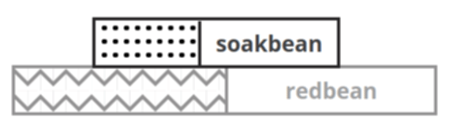

## Reactive plugnplay middleware for redbean

Write beautiful ~2.3MB [redbean (docker) apps](https://redbean.dev) like this [.init.lua](src/.init.lua):

```lua
app = require("soakbean") {
  bin = "./soakbean.com",
  opts = { my_cli_arg=0 },
  cmd={
    -- runtask =  {file="sometask.lua",   info="description of cli cmd"}
  },
  title     = 'SOAKBEAN - a buddy of redbean',
}

app.url['^/data']   = '/data.lua'          -- setup custom file endpoint
                                           --
app.get('^/', app.template('index.html') ) -- alias for app.tpl( LoadAsset('index.html'), app )
                                           -- also see app.post app.put and so on
app                                        --
.use( require("json").middleware() )       -- try plug'n'play json API middleware 
.use( app.router( app.url ) )              -- try url router
.use( app.response() )                     -- try serve app response  (if any)
.use( function(req,next) Route() end)      -- fallback default redbean fileserver

function OnHttpRequest() app.run() end
```

Just run it straight from the repository using [redbean.com](https://redbean.dev) itself:<br>

```
$ https://github.com/coderofsalvation/soakbean 
$ cd src 
$ redbean.com -D . --my-cli-arg=abc
```

Then you can easily package the current directory into your own (renamed redbean) COM-file:

```
$ sed -i 's/NAME=soakbean/NAME=yourapp/g'
$ ./make all
$ ./yourapp.com --my-cli-arg=abc
```

> Profit!


## Beautiful micro stack



* re-use middleware functions across redbean projects
* reactive programming (write less code)
* easy express-style routing
* easily adapt to redbean API changes

## Getting started 

| Easy | DIY | Docker |
|-|-|-|
| download & rename [soakbean.com](https://github.com/coderofsalvation/soakbean/raw/master/soakbean.com) to `soakbean.zip`, add html (and/or lua) files, rename back to `soakbean.com` and run `./soakbean.com` | copy [soakbean.lua](src/.lua/soakbean.lua) (and optional middleware) to your [redbean.com](https://redbean.dev) `.lua` folder, and copy the `.init.lua` above | clone this repo and run `./make docker` and surf to `http://localhost:8080` |

> middleware: copy [middleware](middleware) functions to `src/.lua`-folder where needed

## Cute simple backend<->frontend traffic

Just look at how cute this [index.html](src/index.html) combines serverside templating with RESTful & DOM-reactive templating:

```
<title>${title}</title>                  <-- evaluated serverside                           -->
<span x-text="$store.app.time"/>         <-- evaluated clientside                           -->
<span x-text="$store.app.title"/>        <-- evaluated clientside using REST call to server -->
 
```


## Middleware functions

You can easily manipulate the http-request flow, using existing middleware functions:

```lua
app.use( 
    require("blacklisturl")({
        "^/secret/",
        "^/me-fainting-next-to-justinbieber.mp4"
    })
)
```

> make sure you copy [middleware/blacklisturl.lua](middleware/blacklisturl.lua) to [src/.lua](src/.lua)

or just write ad-hoc middleware:

```lua
app.use( function(req,res,next)
  res.status(200)
  res.header('content-type','text/html')
  res.body('hello world')
  next() -- comment this to prevent further middleware altering body, status headers e.g. 
end)
```

```lua
app.use( function(req,res,next)
    if !req.loggedin && req.url:match("^/mydata") then
       res.status(403)
    else next()
end)
```


> WANTED: please contribute your [middleware](middleware) functions by pushing repositories with nameconvention `soakbean-middleware-<name>`. Everybody loves (re)using battle-tested middleware.

## req & res object

| key | type | alias for redbean |
|-|-|-|
| `req.method` | string | `GetMethod()` |
| `req.url` | string | `GetPath()` |
| `req.param` | table | `GetParams()` |
| `req.host` | string | `GetHost()` |
| `req.header` | table | `GetHeaders()` |
| `req.protocol` | string | `GetScheme()` |
| `req.body` | table or string |  |
| `res.body(value)` | string | `Write(value) including auto-encoding (json e.g.)` |
| `res.status(code)` | int | `SetStatus(code)` |
| `res.header(type,value)` | string,string | `SetHeader(type,value)` |

## Simple template evaluation

index.html
```
<title>${title}</title>
```

lua
```
app.title = "hello world"
app.get('^/', app.template('index.html') ) 
```

> NOTE: this is basically serving the output of `app.tpl( LoadAsset('index.html'), app )` 

## Reactive programming

#### react to variable changes:

```lua
app.on("foo", function(k,v)
  print("appname changed: " .. v)
end)

app.foo = "flop"   -- output: appname changed: flop
app.foo = "bar"    -- output: appname changed: bar
```

#### react to function calls 

```lua 
app.on('foobar', function(a)
    print("!")
end)

app.foobar = function(a)
    print('foobar')
end

app.foobar()       -- output: foobar!
```

#### react to router patterns

```lua
app.url['^/foo'] = '/somefile.lua'

app.on('^/foo', function(a,b)
  -- do something
end)
```

#### react to luafile endpoint execution 

```lua
app.url['^/foo'] = '/somefile.lua'

app.on('somefile.lua', function(a,b)
  -- do something
end)
```

#### react to response code/header/body changes

```lua
app.on('res.status', print )
app.on('res.body'  , print )
app.on('res.header', function(k,v)
  print(k .. " => " .. v)
end)
```

> NOTE: above is handy for debugging a flow. Use `app.use(..)` for more control.

## Roadmap / Scope

* scope is backend, not frontend
* http auth (*)
* middleware: sqlite user sessions (*)
* middleware: sqlite tiny job queue (*)
* middleware: sqlite tiny rule engine (*)
* middleware: sqlite CRUD middleware (endpoints + sqlite schema derived from jsonschema) (*)

\* = please contribute! =]
