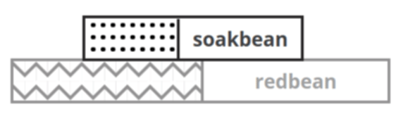

<center></center>

## Usage

* express-style programming
* easy routing
* re-use middleware functions across redbean projects

## Installation

Either:
1. Use the `soakbean.com` as a starting point, add files to `src` and run `./make all && ./soakbean.com`
2. copy [soakbean.lua](src/lua/soakbean.lua) and optionally [json.lua](src/.lua/json.lua) to your redbean `.lua` folder, and copy the `.init.lua` below

## Getting started 

Everything boils down to this [.init.lua](src/.init.lua):

```lua
app = require("soakbean") {
  subtitle = "more SOAK for <a href='https://redbean.dev'>redbean</a>",
  notes   = {"🤩 express-style programming","🖧 easy routing","♻ re-use middleware function"}
}

function OnHttpRequest()
  app.url['^/data']   = '/data.lua'         -- setup file endpoint
  app.use( app.router( app.url ) )          -- url router
  app.use( function(req,next) Route() end)  -- redbean fileserver (Route middleware)
  app.start()
end

app.post('^/save', function(req,next)       -- easy endpoints using .get()
  SetStatus(200)                            -- .post() .put() .delete() .options()
  SetHeader('Content-Type', 'application/json; charset=utf-8')
  local data = {ok=true}
end)
```

## Middleware functions

You can easily manipulate the http-request flow, by putting middleware functions before the `Route()` middleware

```lua
app.use( function(req,next)
    if !req.loggedin && req.url:match("^/secret") 
        SetStatus(403)
    else next()
end)
```

> WANTED: please contribute your middleware functions to the [middleware](middleware) folder. We need stuff like http auth, sqlite login/logout functionality, Sqlite CRUD-middleware e.g.

## Req object

| key | type | alias for redbean |
|-|-|-|
| `req.method` | string | `GetMethod()` |
| `req.url` | string | `GetPath()` |
| `req.param` | table | `GetParams()` |
| `req.host` | string | `GetHost()` |
| `req.header` | table | `GetHeaders()` |
| `req.protocol` | string | `GetScheme()` |
| `req.body` | table (for json POST/PUT/DELETE) or string |  |

## Roadmap / Scope

* scope is backend, not frontend
* http auth
* middleware: sqlite CRUD middleware
* middleware: sqlite user sessions
* middleware: sqlite tiny job queue
* middleware: sqlite tiny rule engine
